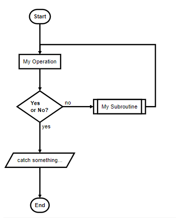

# gatsby-remark-graph

Make nice graphs in your markdown files in gatsbyjs, using [flowchat.js](http://flowchart.js.org/).

## install

`npm install --save gatsby-transformer-remark gatsby-remark-flowchart`


## How to use

```js
// In your gatsby-config.js
plugins: [
  {
    resolve: 'gatsby-transformer-remark',
    options: {
      plugins: [
        `gatsby-remark-flowchart`,
      ]
    }
  }
]
```

Make sure you put it before other plugins (especially those that work with `code` blocks, like [prism](https://www.gatsbyjs.org/packages/gatsby-remark-prismjs/).)

### Usage in Markdown

<pre>
```flowchart
st=>start: Start:>http://www.google.com[blank]
e=>end:>http://www.google.com
op1=>operation: My Operation
sub1=>subroutine: My Subroutine
cond=>condition: Yes
or No?:>http://www.google.com
io=>inputoutput: catch something...

st->op1->cond
cond(yes)->io->e
cond(no)->sub1(right)->op1
```
</pre>

Will give you a graph that looks like this:


